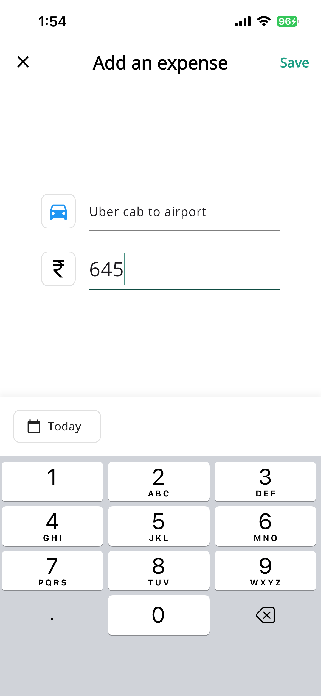
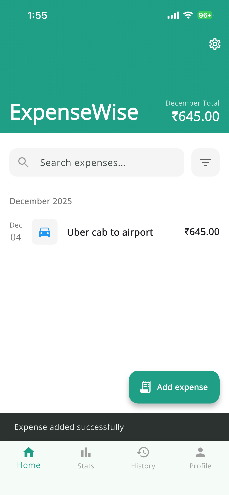
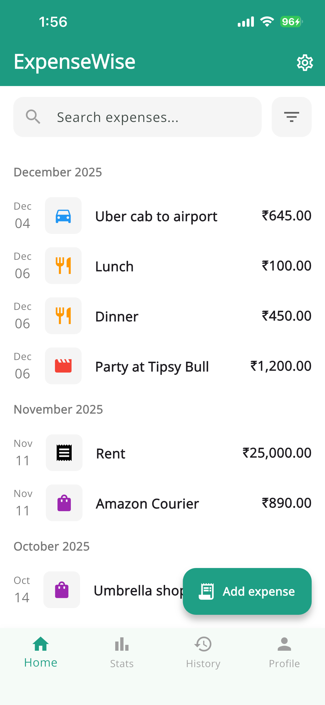
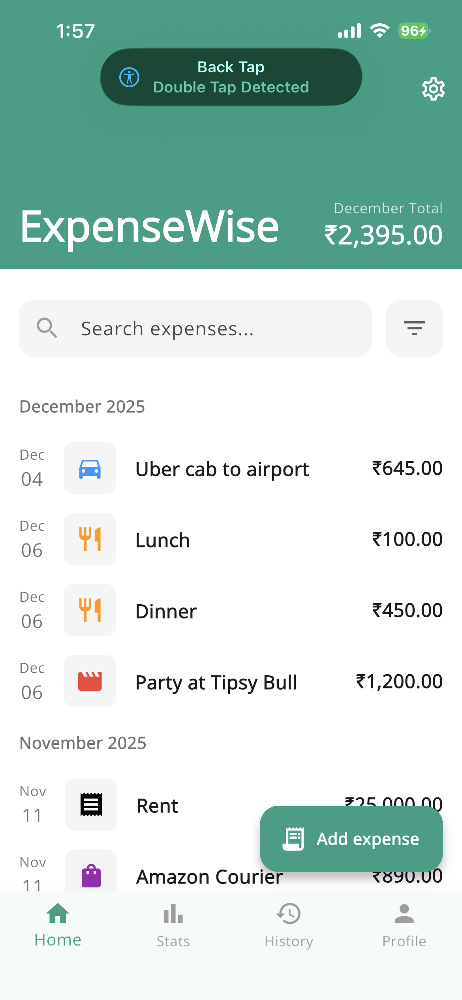
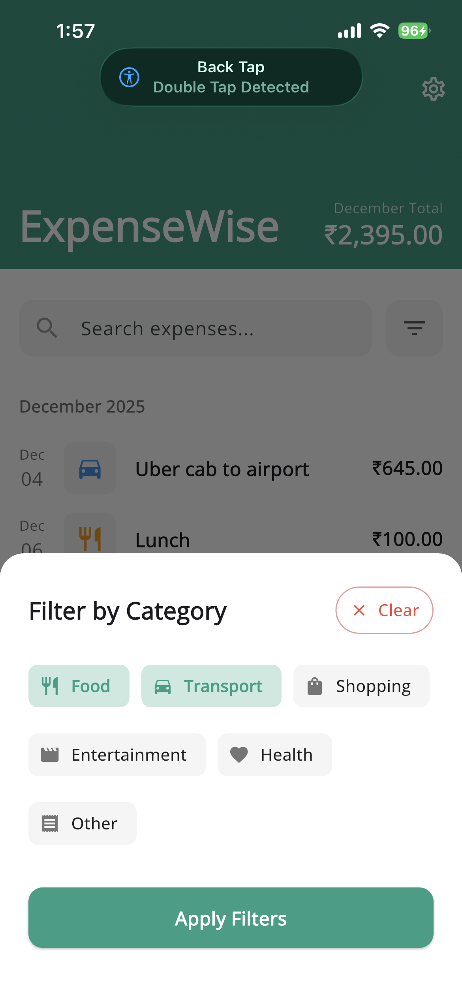
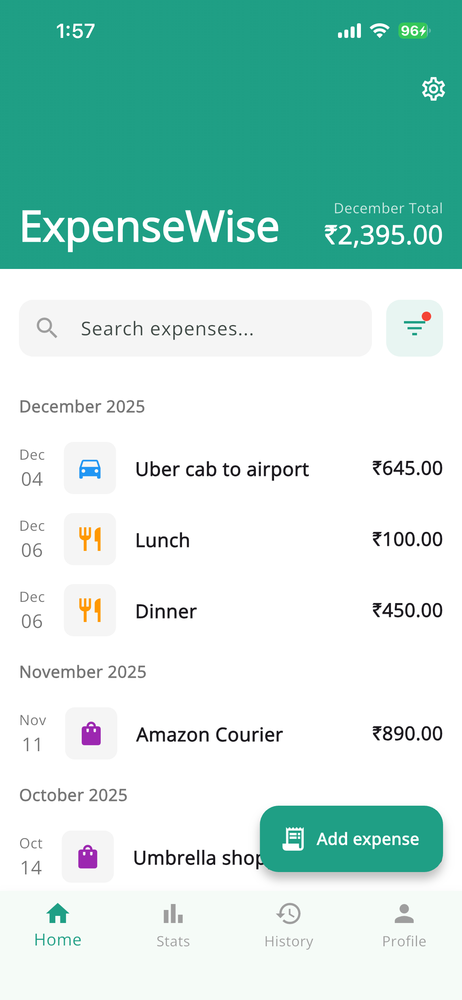
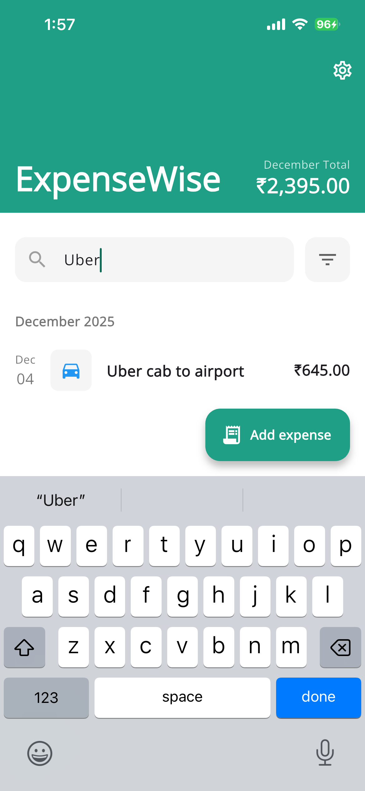
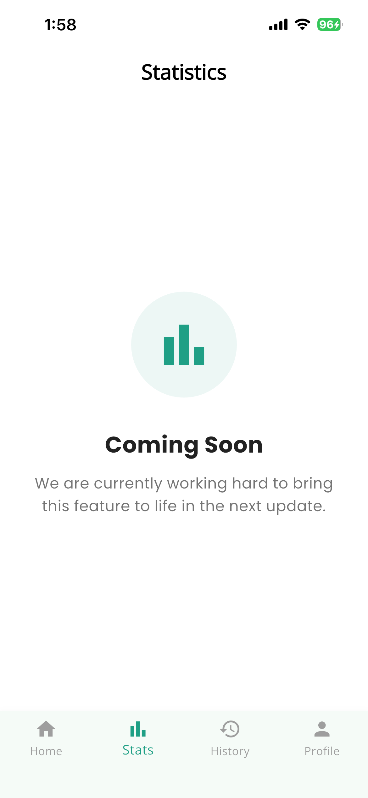

# ExpenseWise 💰

**ExpenseWise** is a robust, offline-first mobile application designed to help users track their daily spending effortlessly. Built with **Flutter**, it demonstrates modern mobile engineering practices, strictly adhering to **Clean Architecture** principles and **Functional Error Handling**.

-----

## 📱 Features

  * **Expense Management:** Add, update, and delete expenses with precision.
  * **Smart Categorization:** Auto-detects categories (Food, Transport, etc.) based on the expense title (e.g., "Uber" $\rightarrow$ Transport).
  * **Search & Filter:** Real-time search by title and robust filtering by specific categories.
  * **Monthly Aggregation:** Expenses are automatically grouped by month/year with calculated totals.
  * **Offline First:** Uses SQLite for reliable local storage, ensuring data is always available without an internet connection.
  * **Clean UI:** A polished interface using `GoogleFonts` (OpenSans) and custom widgets.

-----

## 📸 Screenshots

<p align="center">
  
  
  
  
  
  
  
  
  </p>

-----

## 🏗️ Architecture

This project follows **Clean Architecture** with **MVVM** (Model-View-ViewModel), ensuring a distinct separation of concerns, testability, and scalability.


### Layer Breakdown

1.  **Domain Layer** (Inner Circle)

      * Contains the business logic and contracts (Interfaces).
      * *Completely independent of Flutter dependencies.*
      * **Files:** `ExpenseDataRepository` (Interface), `Failure` models.

2.  **Data Layer** (Outer Circle)

      * Handles data retrieval and storage.
      * Implements the contracts defined in the Domain layer.
      * **Files:** `ExpenseDataRepositoryImpl`, `ExpenseModel` (DTOs), `DBService` (SQLite), `ExpenseDataLocalService`.

3.  **Presentation Layer** (UI)

      * **View:** Widgets like `ExpenseScreen`, `AddExpenseScreen`.
      * **ViewModel:** `StateNotifier` classes (`HomeScreenViewModel`, `AddExpenseViewModel`) that manage state and communicate with the Domain layer.
      * **State Management:** Uses **Riverpod** for dependency injection and state handling.

### Data Flow

`UI Event` $\rightarrow$ `ViewModel` $\rightarrow$ `Repository (Interface)` $\rightarrow$ `Repository (Impl)` $\rightarrow$ `Local Service` $\rightarrow$ `SQLite DB`

-----

## 🛠️ Tech Stack & Libraries

| Library | Usage | Justification |
| :--- | :--- | :--- |
| **flutter\_riverpod** | State Management | Compile-safe dependency injection and state management without `BuildContext` reliance. |
| **sqflite** | Local Database | Reliable, SQL-based persistence for complex queries and aggregations. |
| **dart\_either** | Error Handling | Functional programming approach to handle Success/Failure states explicitly without try-catch blocks in UI. |
| **mocktail** | Testing | Type-safe mocking for unit tests. |
| **google\_fonts** | Typography | Consistent styling across Android and iOS. |
| **intl** | Formatting | Date and Currency formatting tailored to locale (e.g., ₹ INR). |

-----

## 📂 Project Structure

```text
lib/
├── core/                  # Global utilities
│   ├── constants.dart     # DB keys, Table names
│   ├── app_colors.dart    # Design tokens
│   ├── helper/            # UI Helpers (Icons, Colors)
│   └── service/           # Infrastructure (Navigation, DB connection)
├── data/                  # Data Layer
│   ├── model/             # DTOs (Data Transfer Objects)
│   ├── repository/        # Implementation of Domain Repositories
│   ├── service/           # Local Data Source implementations
│   └── enums/             # Expense Categories
├── domain/                # Domain Layer
│   ├── repository/        # Abstract interfaces
│   └── service/           # Abstract service contracts
├── presentation/          # Presentation Layer
│   ├── view/
│   │   ├── screens/       # Full page widgets
│   │   └── widgets/       # Reusable UI components
│   └── viewmodel/         # StateNotifiers (Logic)
└── main.dart              # Entry point & Theme config
```

-----

## 🚀 Getting Started

1.  **Clone the repository:**
    ```bash
    git clone https://github.com/your-username/expense-wise.git
    ```
2.  **Install dependencies:**
    ```bash
    flutter pub get
    ```
3.  **Run the app:**
    ```bash
    flutter run
    ```

-----

## 🧪 Testing

The project contains unit tests for the **Repository** and **ViewModel** layers, ensuring business logic reliability.

To run the tests:

```bash
flutter test
```

### Test Coverage Includes:

  * **Repository Tests:** Verifying `Right` (Success) and `Left` (Failure) returns from SQLite operations.
  * **ViewModel Tests:** Verifying state transitions (`isLoading`, `groupedExpenses` logic, filtering) and side effects (Snackbars).

-----

## 🔮 Future Roadmap (Scalability)

  * [ ] **Pagination:** Implement `LIMIT` and `OFFSET` in `DBService` to handle large datasets efficiently.
  * [ ] **Localization (i18n):** Replace hardcoded strings with `.arb` files for multi-language support.
  * [ ] **Charts:** Integrate chart libraries to visualize spending habits in the "Statistics" tab.
